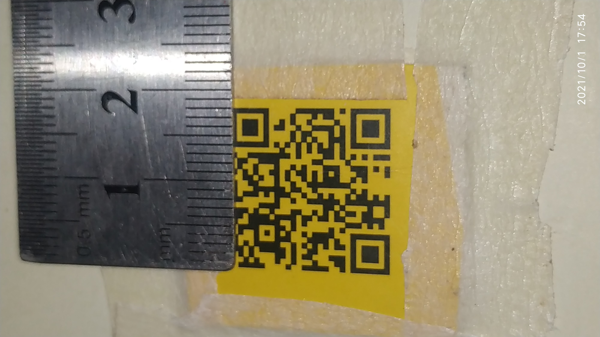

<!-- '''
-------------------------------------------
-    Author: Asadullah Dal                -
-    =============================        -
-    Company Name: AiPhile                -
-    =============================        -
-    Purpose : Youtube Channel            -
-    ============================         -
-    Link: https://youtube.com/c/aiphile  -
-------------------------------------------
''' -->

# Qr-code-detection-distance-estimation

---

## TODO

- [x] [Selecting point with mouse](https://www.youtube.com/watch?v=VUTJeDl-ar8&t=283s)
- [x] [Single Point🟢 Tracking](https://www.youtube.com/watch?v=VUTJeDl-ar8&t=770s)
- [x] [QR code Detection](https://www.youtube.com/watch?v=VUTJeDl-ar8&t=1188s)
- [x] [Improve QR code Detection Range with Optical Flow](https://www.youtube.com/watch?v=VUTJeDl-ar8&t=1647s)
- [x] [Distance Estimation of QR code with optical Flow and Pyzbar](https://www.youtube.com/watch?v=VUTJeDl-ar8&t=2120s)

---

Complete Video Tutorial: [Youtube Video Tutorial](https://youtu.be/VUTJeDl-ar8)

---

## Installation of Python Modules [Video Tutorial](https://www.youtube.com/watch?v=VUTJeDl-ar8&t=165s)

### Windows 💠

#### OpenCV Python and Pyzbar

```
pip install opencv-python pyzbar
```

#### OpenCV Python and PyZbar

```
pip3 install opencv-python pyzbar
```

---

## Basic of Optical Flow 🔍 [Video Tutorial](https://www.youtube.com/watch?v=VUTJeDl-ar8&t=770s)

Tracking single point, using optical flow

## Basics of QR Code 💻[Video Tutorial](https://www.youtube.com/watch?v=VUTJeDl-ar8&t=1188s)

Detecting the QR code with pyzbar

## Combination of QR code Detection and Optical-flow  [Video Tutorial](https://www.youtube.com/watch?v=VUTJeDl-ar8&t=1647s)

Maximizing the Range 🐎 of QR code detecting with Optical-flow 🔎

## Distance Estimation, Maximized Ranged Detection  [Video Tutorial](https://www.youtube.com/watch?v=VUTJeDl-ar8&t=2120s)

Estimating the distance using QR code detection and Optical flow

Known width or height measurement, since QR code are Square(width and height are same here)



if You found this Helpful, please star :star: it.

You can Watch my Video Tutorial on Computer Vision Topics, just check out my YouTube Channel <a href="https://www.youtube.com/c/aiphile">   </a>

If You have any Question or need help in CV Project, Feel free to DM on Instagram  <a href="https://www.instagram.com/aiphile17/">   </a>

## 💚🖤 Join me on Social Media 💚🖤

<h4><a href="https://www.youtube.com/c/aiphile"> YouTube  </a>
 <a href="https://github.com/Asadullah-Dal17">  GitHub   </a>
  <a href="https://www.instagram.com/aiphile17/">   Instagram  </a> </h4>
